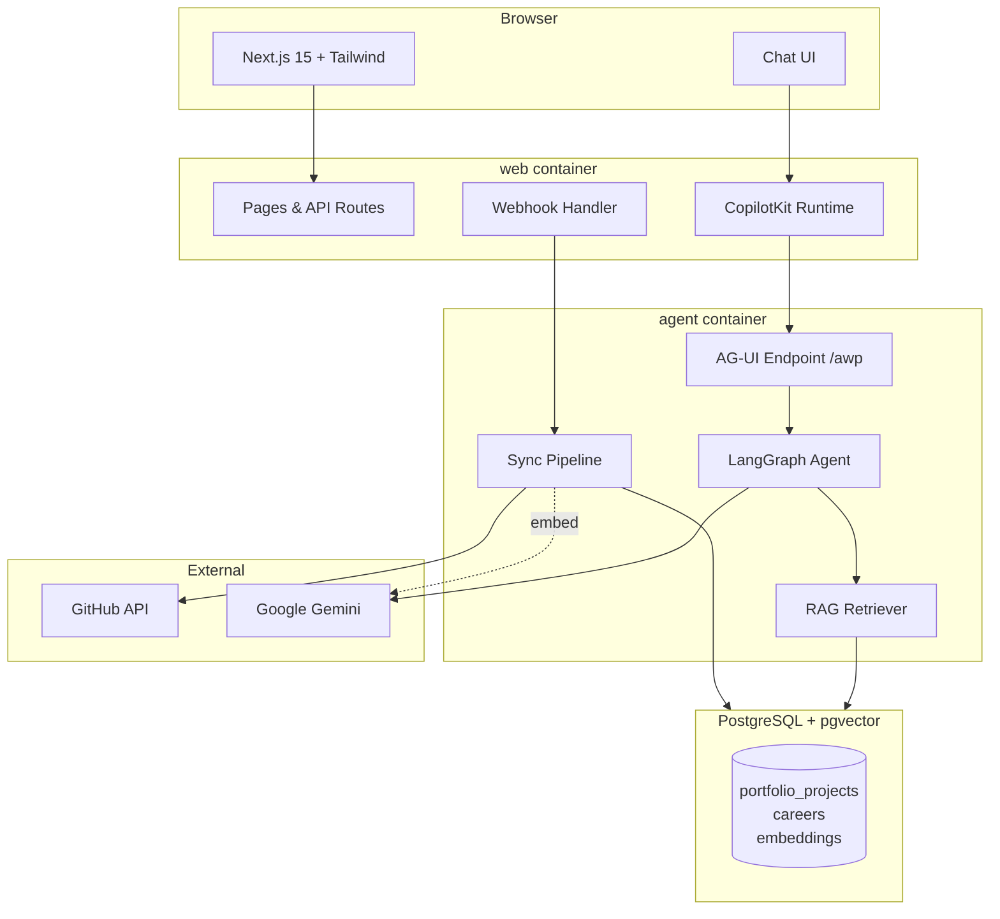
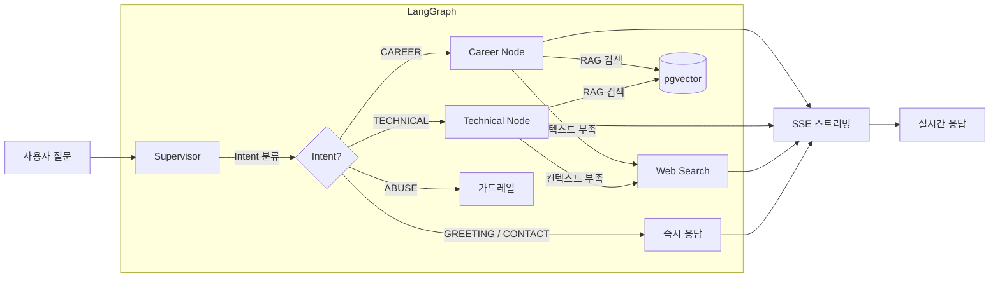
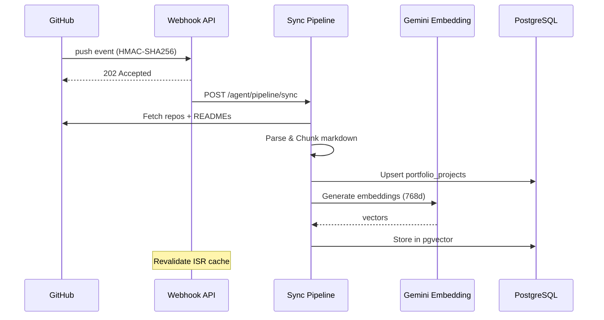

# PortfolioLive

개인 포트폴리오 & 경력 소개 사이트에 **Agentic AI Chat**을 결합한 서비스.
정적인 이력 소개를 넘어, 방문자가 자연어로 경력과 기술을 직접 질문하고 대화할 수 있습니다.

> **Live**: https://me.zerolive.co.kr

---

## Architecture

### System Overview

### Agentic Chat Flow

**모델 선택**: Flash(빠른 분류/간단 응답) vs Pro(복잡한 기술 질문) 자동 전환

### GitHub Sync Pipeline

새 repo가 추가되면 `sort_order=0`으로 삽입되어 포트폴리오 최상단에 표시됩니다.

---

## Features

### Agentic AI Chat

LangGraph 멀티 에이전트가 방문자의 질문에 실시간으로 답변합니다.

- **Intent 분류** — Supervisor가 질문을 6개 카테고리로 분류 (Career / Technical / Contact / Greeting / Out-of-scope / Abuse)
- **RAG 검색** — 경력, 프로젝트 README를 pgvector 코사인 유사도로 검색 (top-k=6, threshold≥0.5)
- **멀티턴 대화** — 쿼리 리라이팅으로 대명사/맥락 해소
- **Web Search 폴백** — RAG 결과 부족 시 Gemini Google Search로 보완
- **가드레일** — 범위 이탈/악용 3회 시 세션 종료
- **SSE 스트리밍** — AG-UI 프로토콜로 토큰 단위 실시간 전송

### Portfolio Showcase

- GitHub 자동 동기화 (Webhook + 수동 Sync)
- 카테고리 필터 (AI & Voice / STB / Side Projects)
- README 마크다운 렌더링
- 프로젝트별 기술 스택 태그

### Admin Dashboard

- 경력/프로젝트/프로필 관리
- 채팅 로그 및 방문 통계
- GitHub Sync 수동 트리거
- 사이트 설정 (히어로 문구 등)

---

## Tech Stack

| Layer | Stack |
|-------|-------|
| Frontend | Next.js 15, Tailwind CSS, CopilotKit |
| Agent | FastAPI, LangGraph, Gemini 2.5 (Flash + Pro), AG-UI Protocol |
| RAG | Gemini Embedding 001 (768d), pgvector cosine similarity |
| Database | PostgreSQL 16 + pgvector |
| Infra | Docker Compose, Cloudflare |

---

## License

Private
